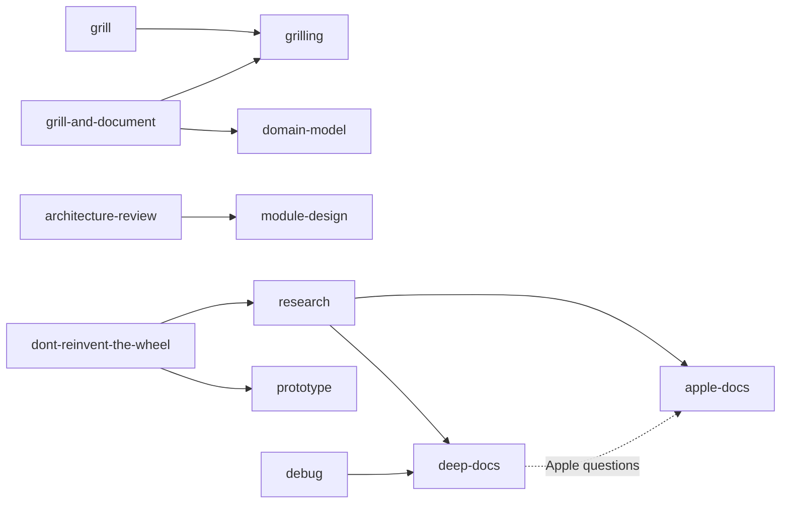

# Agent Skills

> My personal collection of [Agent Skills](https://code.claude.com/docs/en/skills), ready for any
> skill-aware coding agent.

Most of these started as someone else's open source skill. Every one has been rewritten for how
I actually work: less process, narrower triggers, tighter safety.

**🙏 Every upstream project is credited in the tables below, with a link.** If a skill is useful
to you, the credit belongs to its original author.

> [!NOTE]
> Public so the work is inspectable, but tuned to one person. **Fork it, don't depend on it.**

---

## 🧭 Two kinds of skill

| | Acts on | Configured by `setup-agent-docs`? |
| --- | --- | --- |
| **🛠️ Project skills** | A codebase | Yes |
| **🏠 Personal skills** | My machine and my life | No, on purpose |

A repository has no business configuring conventions for a skill that cleans my disk.

---

## 🛠️ Project skills

| Skill | Invocation | What it does | Upstream |
| --- | --- | --- | --- |
| [`apple-docs`](apple-docs/) | Model or user | Version-aware **Apple platform documentation**: Apple docs, Swift Evolution, Xcode and project context, local Xcode docs, HIG, WWDC, release notes, signing and distribution. | [Ahrentlov/apple-docs-skill](https://github.com/Ahrentlov/apple-docs-skill) |
| [`architecture-review`](architecture-review/) | User | Assess a codebase and **rank architecture improvements** against concrete code evidence. | [mattpocock/skills → improve-codebase-architecture](https://github.com/mattpocock/skills/tree/main/skills/engineering/improve-codebase-architecture) |
| [`debug`](debug/) | Model or user | **Diagnose a hard bug**: reproduce, hypothesize, find the root cause, minimal fix, verify. | [mattpocock/skills → diagnosing-bugs](https://github.com/mattpocock/skills/tree/main/skills/engineering/diagnosing-bugs) |
| [`deep-docs`](deep-docs/) | Model or user | Version-aware **documentation research** for non-Apple frameworks, SDKs, APIs, CLIs and platforms, with source-linked evidence. | Written for this collection. Architecture adapted from [apple-docs-skill](https://github.com/Ahrentlov/apple-docs-skill) and [appledeepdoc-mcp](https://github.com/Ahrentlov/appledeepdoc-mcp) |
| [`domain-model`](domain-model/) | Model or user | Clarify **contradictory domain terminology**, states, rules and relationships. | [mattpocock/skills → domain-modeling](https://github.com/mattpocock/skills/tree/main/skills/engineering/domain-modeling) |
| [`dont-reinvent-the-wheel`](dont-reinvent-the-wheel/) | Model or user | **Build or reuse?** Decide whether one capability should use an existing feature, a native capability, a dependency, a service, or custom code. | [felinto-dev/felinto-skills → dont-reinvent-the-wheel](https://github.com/felinto-dev/felinto-skills/tree/main/.agents/skills/dont-reinvent-the-wheel) |
| [`grill`](grill/) | User | **Pressure-test a plan** through a focused interview. Writes nothing. | [mattpocock/skills → grill-me](https://github.com/mattpocock/skills/tree/main/skills/productivity/grill-me) |
| [`grill-and-document`](grill-and-document/) | User | Same interview, but **preserves** canonical domain language and consequential decisions. | [mattpocock/skills → grill-with-docs](https://github.com/mattpocock/skills/tree/main/skills/engineering/grill-with-docs) |
| [`grilling`](grilling/) | Model or user | The shared **interview discipline**: one decision at a time, always with a recommendation. | [mattpocock/skills → grilling](https://github.com/mattpocock/skills/tree/main/skills/productivity/grilling) |
| [`handoff`](handoff/) | User | Write a compact **continuation note** for another agent or a later session. | [mattpocock/skills → handoff](https://github.com/mattpocock/skills/tree/main/skills/productivity/handoff) |
| [`module-design`](module-design/) | Model or user | Improve **module boundaries**, interfaces, dependency direction, cohesion and test seams. | [mattpocock/skills → codebase-design](https://github.com/mattpocock/skills/tree/main/skills/engineering/codebase-design) |
| [`prototype`](prototype/) | Model or user | Run a **disposable experiment** when executing code beats discussing it. | [mattpocock/skills → prototype](https://github.com/mattpocock/skills/tree/main/skills/engineering/prototype) |
| [`research`](research/) | Model or user | Answer a technical or product question from **current primary sources**. | [mattpocock/skills → research](https://github.com/mattpocock/skills/tree/main/skills/engineering/research) |
| [`resolve-conflicts`](resolve-conflicts/) | Model or user | Resolve a **merge, rebase or cherry-pick** by reconstructing the intent of both sides. | [mattpocock/skills → resolving-merge-conflicts](https://github.com/mattpocock/skills/tree/main/skills/engineering/resolving-merge-conflicts) |
| [`setup-agent-docs`](setup-agent-docs/) | User | Configure optional **per-repository paths** for glossaries, ADRs, research, handoffs and prototypes. | [mattpocock/skills → setup-matt-pocock-skills](https://github.com/mattpocock/skills/tree/main/skills/engineering/setup-matt-pocock-skills) |
| [`skill-authoring`](skill-authoring/) | User | Create, review or simplify **Agent Skills**. | [mattpocock/skills → writing-great-skills](https://github.com/mattpocock/skills/tree/main/skills/productivity/writing-great-skills) |

---

## 🏠 Personal skills

| Skill | Invocation | What it does | Upstream |
| --- | --- | --- | --- |
| [`disk-cleaner`](disk-cleaner/) | Model or user | **Audit a machine for reclaimable disk space**: caches, build artifacts, dependency stores, duplicates, leftovers from removed apps. Classifies everything by risk, cleans only what was approved. | [gccszs/disk-cleaner](https://github.com/gccszs/disk-cleaner) |
| [`grey-market`](grey-market/) | Model or user | **Find digital products far below the official price** in regional markets, through community sources instead of ordinary search. Locates sellers, never transacts. | [felinto-dev/felinto-skills → grey-market](https://github.com/felinto-dev/felinto-skills/tree/main/.agents/skills/grey-market) |

---

## ⚡ Invocation

**Model or user**
: The agent may load it on its own when the description matches, and I can invoke it by name.
Descriptions are narrow, with explicit non-triggers, so they stay quiet during ordinary work.

**User**
: By name only (`disable-model-invocation: true`). Broad reviews, interviews and file-writing
workflows that should never start on their own.

---

## 🔗 How they relate

Cross-references exist only where the dependency is real.

Conditional edges, spelled out

- `architecture-review` reaches for `domain-model` or `grilling` only when the review actually
  needs them.
- `dont-reinvent-the-wheel` reaches for `grilling` when unresolved requirements would change the
  decision, and for `architecture-review` only on an explicitly requested broad reuse audit.
- `research`, `debug` and `dont-reinvent-the-wheel` route to `apple-docs` or `deep-docs` only
  when the answer depends on documented behavior.

---

## 📦 Using one elsewhere

Every skill directory is self-contained. Copy the one you want into your agent's or your
project's skills directory. Conventions for changing anything here live in
[AGENTS.md](AGENTS.md).

> [!WARNING]
> **Do not run `npx skills update` on these.** It would overwrite the personalization. Review
> upstream changes and port over only what is worth having.

---

## 📄 License

The original work here (the personalization, the docs, the references) is
[MIT licensed](LICENSE).

That grant covers my work only. Vendored upstream code keeps its own license, and it does not
extend to `dont-reinvent-the-wheel` or `grey-market`, whose upstream publishes no license at
all. [NOTICE.md](NOTICE.md) says exactly what applies to what.
