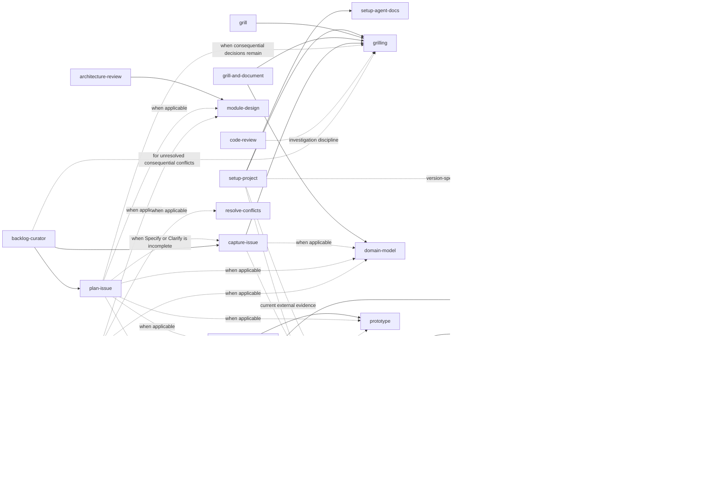

# Agent Skills

> My personal collection of [Agent Skills](https://code.claude.com/docs/en/skills), ready for any
> skill-aware coding agent.

Most of these started as someone else's open source skill. Every one has been rewritten for how
I actually work: less process, narrower triggers, tighter safety.

**🙏 Every upstream project is credited in the tables below, with a link.** If a skill is useful
to you, the credit belongs to its original author.

> [!NOTE]
> Public so the work is inspectable, but tuned to one person. **Fork it, don't depend on it.**

---

## 🧭 How this is organized

Two independent axes. **Scope** is where a skill acts. **Role** is what it does in the flow.
Frequency is deliberately not a category: `resolve-conflicts` can go months unused and is still
a workflow.

| Scope | Acts on | Configured by `setup-agent-docs`? |
| --- | --- | --- |
| `project` | A codebase | Yes |
| `personal` | My machine and my life | No, on purpose |
| `meta` | The skills and the agent setup themselves | Not applicable |

A repository has no business configuring conventions for a skill that cleans my disk. The two
`meta` skills are listed under **Project skills** below, because that is where they run.

| Role | What it means |
| --- | --- |
| **Setup** | Prepares an environment or agrees a convention. Runs once in a while. |
| **Foundation** | A reusable capability other skills delegate part of their work to. |
| **Workflow** | One concrete task, with a start, a process and a finish. |
| **Audit** | Inspects what already exists and ranks findings. Proposes, does not implement. |
| **Authoring** | Produces a durable artifact as its main output. |
| **Utility** | An operational task outside any project. |

Both axes live in frontmatter, alongside a third property that is easy to get wrong by reading
prose alone:

```yaml
metadata:
  scope: project
  role: audit
  mutation: docs
```

`mutation` is how far a skill may go: `none`, `temporary` (disposable files, all reported),
`docs` (documentation only, never production code), `write` (project code or configuration),
`approval-gated` (nothing at all without a confirmed per-item decision).

Directories stay flat. The taxonomy is metadata, not a path, so every skill directory remains
copyable on its own.

One group below breaks the role grouping on purpose. The **issue pipeline** skills are listed by
the SDD phase they own, because the phase is what tells them apart and the role does not:
`capture-issue` and `plan-issue` are both `authoring`, which says nothing about one coming
before the other. Their `role` is still declared in frontmatter and unchanged.

---

## 🛠️ Project skills

### Setup

| Skill | Invocation | Writes | What it does | Upstream |
| --- | --- | --- | --- | --- |
| [`setup-agent-docs`](setup-agent-docs/) | Model or user | `docs` | Configure optional **per-repository paths** for glossaries, ADRs, research, handoffs and prototypes. | [mattpocock/skills → setup-matt-pocock-skills](https://github.com/mattpocock/skills/tree/main/skills/engineering/setup-matt-pocock-skills) |
| [`setup-project`](setup-project/) | User | `write` | Bootstrap or align a repository's **identity, operating rules, Git policy, public metadata and applicable project foundations**. | Written for this collection. |

### Issue pipeline

One issue travels six [spec-driven](https://github.com/github/spec-kit) phases, and each phase
has an owner. There is no separate Review phase: `code-review` declares itself the `Validate`
phase, because a pull request is verified against the issue that commissioned it.

| Order | Phase | Lead role | Goal | Skill |
| --- | --- | --- | --- | --- |
| 1 | **Specify** | Product | State what has to be done, and the requirements it has to satisfy | [`capture-issue`](capture-issue/) |
| 2 | **Clarify** | Product | Settle the ambiguities, decisions and open cases | [`capture-issue`](capture-issue/) |
| 3 | **Plan** | Architect | Decide how to implement it: architecture and strategy | [`plan-issue`](plan-issue/) |
| 4 | **Tasks** | Architect | Break the plan into executable tasks and their dependencies | [`plan-issue`](plan-issue/) |
| 5 | **Implement** | Implementer | Execute the tasks and produce the code | [`implement-issue`](implement-issue/) |
| 6 | **Validate** | Validator | Verify requirements, tests, regressions and quality | [`code-review`](code-review/) |

`backlog-curator` sits across all six rather than inside one. It reads the whole backlog, finds
the issues stuck without a phase, and hands them to the skill that owns it.

| Skill | Invocation | Writes | What it does | Upstream |
| --- | --- | --- | --- | --- |
| [`capture-issue`](capture-issue/) | Model or user | `write` | **Convert a problem or request** into one canonical GitHub Issue (Specify, Clarify). Owns the [label taxonomy](capture-issue/LABELS.md). | Written for this collection. |
| [`plan-issue`](plan-issue/) | User | `write` | **Plan the implementation and tasks** for exactly one GitHub Issue, and size its effort. | [obra/superpowers](https://github.com/obra/superpowers) |
| [`implement-issue`](implement-issue/) | User | `write` | **Implement exactly one prepared GitHub Issue** by writing code, tests, and documentation. | [martonpaulo/tabelo](https://github.com/martonpaulo/tabelo), [openclaw/openclaw](https://github.com/openclaw/openclaw), [github/spec-kit](https://github.com/github/spec-kit) |
| [`code-review`](code-review/) | User | `write` | **Validate exactly one pull request** against the controlling issue and repository rules. | [NousResearch/hermes-agent](https://github.com/NousResearch/hermes-agent), [SpillwaveSolutions/pr-reviewer-skill](https://github.com/SpillwaveSolutions/pr-reviewer-skill) |
| [`backlog-curator`](backlog-curator/) | User | `write` | **Review the whole backlog**: duplicates, obsolete issues, taxonomy drift, missing phases. Ends on a [dependency graph](backlog-curator/DEPENDENCY-GRAPH.md) of the blocking order. | [github/gh-aw](https://github.com/github/gh-aw) (behavioral ref) |

#### Labels

The pipeline is only as sortable as its labels, so the taxonomy is closed where it can be:
exactly one `type:` and one `priority:` per issue, at most one `effort:`, and any number of open
`area:` values. A repository with its own convention wins; this is the default when it has none.
[capture-issue/LABELS.md](capture-issue/LABELS.md) has the values and the rules.

### Foundations

Reusable capabilities. Invocable directly, but their real job is being delegated to.

| Skill | Invocation | Writes | What it does | Upstream |
| --- | --- | --- | --- | --- |
| [`apple-docs`](apple-docs/) | Model or user | `none` | Version-aware **Apple platform documentation**: Apple docs, Swift Evolution, Xcode and project context, local Xcode docs, HIG, WWDC, release notes, signing and distribution. | [Ahrentlov/apple-docs-skill](https://github.com/Ahrentlov/apple-docs-skill) |
| [`context7`](context7/) | Model or user | `none` | **Quick library documentation** from the Context7 index through its CLI: resolve a library ID, then query one topic. Version-aware, and honest about being an index rather than a source. | [upstash/context7 → context7-cli](https://github.com/upstash/context7/tree/master/skills/context7-cli) |
| [`deep-docs`](deep-docs/) | Model or user | `none` | Version-aware **documentation research** for non-Apple frameworks, SDKs, APIs, CLIs and platforms, with source-linked evidence. | Written for this collection. Architecture adapted from [apple-docs-skill](https://github.com/Ahrentlov/apple-docs-skill) and [appledeepdoc-mcp](https://github.com/Ahrentlov/appledeepdoc-mcp) |
| [`domain-model`](domain-model/) | Model or user | `docs` | Clarify **contradictory domain terminology**, states, rules and relationships. | [mattpocock/skills → domain-modeling](https://github.com/mattpocock/skills/tree/main/skills/engineering/domain-modeling) |
| [`grilling`](grilling/) | Model or user | `none` | The shared **interview discipline**: one decision at a time, always with a recommendation. | [mattpocock/skills → grilling](https://github.com/mattpocock/skills/tree/main/skills/productivity/grilling) |
| [`prototype`](prototype/) | Model or user | `temporary` | Run a **disposable experiment** when executing code beats discussing it. | [mattpocock/skills → prototype](https://github.com/mattpocock/skills/tree/main/skills/engineering/prototype) |
| [`research`](research/) | Model or user | `docs` | Answer a technical or product question from **current primary sources**. | [mattpocock/skills → research](https://github.com/mattpocock/skills/tree/main/skills/engineering/research) |

### Workflows

| Skill | Invocation | Writes | What it does | Upstream |
| --- | --- | --- | --- | --- |
| [`debug`](debug/) | Model or user | `write` | **Diagnose a hard bug**: reproduce, hypothesize, find the root cause, minimal fix, verify. | [mattpocock/skills → diagnosing-bugs](https://github.com/mattpocock/skills/tree/main/skills/engineering/diagnosing-bugs) |
| [`dont-reinvent-the-wheel`](dont-reinvent-the-wheel/) | Model or user | `none` | **Build or reuse?** Decide whether one capability should use an existing feature, a native capability, a dependency, a service, or custom code. | [felinto-dev/felinto-skills → dont-reinvent-the-wheel](https://github.com/felinto-dev/felinto-skills/tree/main/.agents/skills/dont-reinvent-the-wheel) |
| [`grill`](grill/) | User | `none` | **Pressure-test a plan** through a focused interview. Writes nothing. | [mattpocock/skills → grill-me](https://github.com/mattpocock/skills/tree/main/skills/productivity/grill-me) |
| [`module-design`](module-design/) | Model or user | `write` | Improve **module boundaries**, interfaces, dependency direction, cohesion and test seams. | [mattpocock/skills → codebase-design](https://github.com/mattpocock/skills/tree/main/skills/engineering/codebase-design) |
| [`resolve-conflicts`](resolve-conflicts/) | Model or user | `write` | Resolve a **merge, rebase or cherry-pick** by reconstructing the intent of both sides. | [mattpocock/skills → resolving-merge-conflicts](https://github.com/mattpocock/skills/tree/main/skills/engineering/resolving-merge-conflicts) |

### Audits

Read what exists, rank what is worth fixing, change nothing on their own.

| Skill | Invocation | Writes | What it does | Upstream |
| --- | --- | --- | --- | --- |
| [`architecture-review`](architecture-review/) | User | `docs` | Assess a codebase and **rank architecture improvements** against concrete code evidence. | [mattpocock/skills → improve-codebase-architecture](https://github.com/mattpocock/skills/tree/main/skills/engineering/improve-codebase-architecture) |
| [`bug-hunter`](bug-hunter/) | User | `temporary` | Find **verified functional, logic, runtime and security bugs** through an adversarial audit; never fixes them. | [codexstar69/bug-hunter](https://github.com/codexstar69/bug-hunter) |
| [`product-audit`](product-audit/) | User | `none` | Audit **UI, UX, accessibility and copy** at routed `low`, `medium` or `high` depth; never implements findings. | [jakubkrehel/skills](https://github.com/jakubkrehel/skills), [content-designer/ux-writing-skill](https://github.com/content-designer/ux-writing-skill), [Thecsiz/ux-critique](https://github.com/Thecsiz/ux-critique) |

### Authoring

| Skill | Invocation | Writes | What it does | Upstream |
| --- | --- | --- | --- | --- |
| [`grill-and-document`](grill-and-document/) | User | `docs` | The `grill` interview, but **preserves** canonical domain language and consequential decisions. | [mattpocock/skills → grill-with-docs](https://github.com/mattpocock/skills/tree/main/skills/engineering/grill-with-docs) |
| [`handoff`](handoff/) | User | `docs` | Write a compact **continuation note** for another agent or a later session. | [mattpocock/skills → handoff](https://github.com/mattpocock/skills/tree/main/skills/productivity/handoff) |
| [`skill-authoring`](skill-authoring/) | User | `write` | Create, review or simplify **Agent Skills**. | [mattpocock/skills → writing-great-skills](https://github.com/mattpocock/skills/tree/main/skills/productivity/writing-great-skills) |

---

## 🏠 Personal skills

All `utility`. They act on my machine and my life, never on a repository.

| Skill | Invocation | Writes | What it does | Upstream |
| --- | --- | --- | --- | --- |
| [`disk-cleaner`](disk-cleaner/) | Model or user | `approval-gated` | **Audit a machine for reclaimable disk space**: caches, build artifacts, dependency stores, duplicates, leftovers from removed apps. Classifies everything by risk, cleans only what was approved. | [gccszs/disk-cleaner](https://github.com/gccszs/disk-cleaner) |
| [`grey-market`](grey-market/) | Model or user | `none` | **Find digital products far below the official price** in regional markets, through community sources instead of ordinary search. Locates sellers, never transacts. | [felinto-dev/felinto-skills → grey-market](https://github.com/felinto-dev/felinto-skills/tree/main/.agents/skills/grey-market) |

---

## ⚡ Invocation

**Model or user**
: The agent may load it on its own when the description matches, and I can invoke it by name.
Descriptions are narrow, with explicit non-triggers, so they stay quiet during ordinary work.
This also includes narrow child workflows that an already user-invoked parent explicitly delegates.

**User**
: By name only (`disable-model-invocation: true`). Broad reviews, interviews and file-writing
workflows that should never start on their own.

---

## 🔗 How they relate

Cross-references exist only where the dependency is real.



<details>
<summary>Conditional edges, spelled out</summary>

- `setup-project` delegates optional glossary, ADR, research, handoff and prototype path
  selection to `setup-agent-docs` after establishing the repository's root guidance. It uses
  `grilling` for the one-time setup decisions, `research` only for current external evidence,
  and `apple-docs` or `deep-docs` only for version-specific configuration.
- `architecture-review` reaches for `domain-model` or `grilling` only when the review actually
  needs them.
- `bug-hunter` routes versioned Apple behavior to `apple-docs` and other framework or library
  behavior to `deep-docs`; it hands a user-selected confirmed finding to `debug` only in a
  separate implementation task.
- `dont-reinvent-the-wheel` reaches for `grilling` when unresolved requirements would change the
  decision, and for `architecture-review` only on an explicitly requested broad reuse audit.
- `research`, `debug` and `dont-reinvent-the-wheel` route to `apple-docs` or `deep-docs` only
  when the answer depends on documented behavior.
- `context7` and `deep-docs` trade in both directions. Context7 is an index of other people's
  documentation, so it is the fast path for a library's current API, and `deep-docs` takes over
  whenever the conclusion has to be traced to an official versioned source, or the library is
  not indexed at all.
- `capture-issue` routes to `domain-model` or `research` only when existing ambiguity or missing evidence prevents capturing the issue.
- `plan-issue` delegates to `capture-issue` if the Specify/Clarify foundation is incomplete, and conditionally routes to specialized design/prototype skills when needed.
- `implement-issue` routes to specialized work skills (e.g., `debug`, `resolve-conflicts`) when they directly apply to implementing the single prepared issue.
- `backlog-curator` delegates missing phases for an issue to `capture-issue` or `plan-issue`.

</details>

---

## 📦 Using one elsewhere

Every skill directory is self-contained. Copy the one you want into your agent's or your
project's skills directory. Conventions for changing anything here live in
[AGENTS.md](AGENTS.md).

> [!WARNING]
> **Do not run `npx skills update` on these.** It would overwrite the personalization. Review
> upstream changes and port over only what is worth having.

### Sync all skills

The commands link every top-level skill directly into the corresponding agent directory, so
repository changes are available immediately without copying files. They are safe to run
repeatedly and can be called from any working directory:

```sh
/path/to/skills/sync-all
/path/to/skills/sync-agents
/path/to/skills/sync-claude
/path/to/skills/sync-gemini
```

`sync-all` updates every destination at once: `~/.agents/skills`, `~/.claude/skills` and
`~/.gemini/config/skills`. The other three update only their named destination. Use `--dry-run`
to preview any command. Existing real files and directories are reported as conflicts and left
untouched.

To make the combined command available in zsh, link it from a directory already on `PATH`:

```sh
mkdir -p ~/.local/bin
ln -s /path/to/skills/sync-all ~/.local/bin/sync-all
```

---

## 📄 License

The original work here (the personalization, the docs, the references) is
[MIT licensed](LICENSE).

That grant covers my work only. Vendored upstream code keeps its own license, and it does not
extend to `dont-reinvent-the-wheel` or `grey-market`, whose upstream publishes no license at
all. [NOTICE.md](NOTICE.md) says exactly what applies to what.
