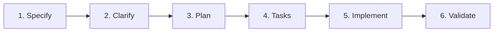
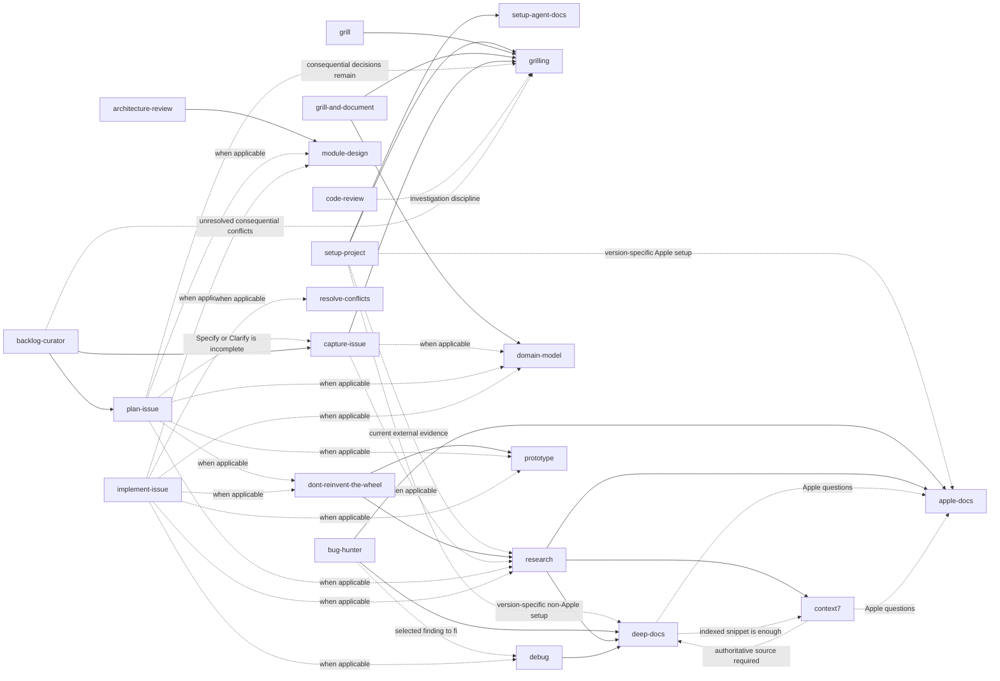

# Agent Skills

My personal collection of [Agent Skills](https://code.claude.com/docs/en/skills), ready for any skill-aware coding agent.

Most of these skills started in other open-source projects. Every one has been reviewed and adapted to match how I actually work: narrower triggers, less unnecessary process, clearer responsibilities, and tighter safety boundaries.

Every upstream project is credited below. If a skill is useful, credit belongs to its original author.

<br />

## 🧭 Start here

Choose a skill based on the result you need.

| I need to…                                       | Use                                                   |
| ------------------------------------------------ | ----------------------------------------------------- |
| Set up or align a repository                     | [`setup-project`](setup-project/)                     |
| Convert a request into a complete GitHub Issue   | [`capture-issue`](capture-issue/)                     |
| Plan the implementation of one issue             | [`plan-issue`](plan-issue/)                           |
| Implement one prepared issue                     | [`implement-issue`](implement-issue/)                 |
| Validate a pull request before merging           | [`code-review`](code-review/)                         |
| Organize and prioritize the complete backlog     | [`backlog-curator`](backlog-curator/)                 |
| Diagnose and fix a difficult bug                 | [`debug`](debug/)                                     |
| Decide whether to build or reuse a capability    | [`dont-reinvent-the-wheel`](dont-reinvent-the-wheel/) |
| Improve module boundaries and dependencies       | [`module-design`](module-design/)                     |
| Resolve a merge, rebase, or cherry-pick conflict | [`resolve-conflicts`](resolve-conflicts/)             |
| Review the architecture of a codebase            | [`architecture-review`](architecture-review/)         |
| Search aggressively for real bugs                | [`bug-hunter`](bug-hunter/)                           |
| Audit UI, UX, accessibility, or copy             | [`product-audit`](product-audit/)                     |
| Research a current technical or product question | [`research`](research/)                               |
| Research Apple platform behavior                 | [`apple-docs`](apple-docs/)                           |
| Research another framework, SDK, API, or CLI     | [`deep-docs`](deep-docs/)                             |
| Quickly look up a library API                    | [`context7`](context7/)                               |
| Pressure-test a plan through questions           | [`grill`](grill/)                                     |
| Preserve decisions from an interview             | [`grill-and-document`](grill-and-document/)           |
| Create a continuation note for another session   | [`handoff`](handoff/)                                 |
| Create, review, or simplify an Agent Skill       | [`skill-authoring`](skill-authoring/)                 |
| Audit and reclaim disk space safely              | [`disk-cleaner`](disk-cleaner/)                       |
| Research cheaper regional digital-product offers | [`grey-market`](grey-market/)                         |

<br />

## Issue delivery workflow

The main development workflow follows six phases:



Each phase has one owner, one primary goal, and one exit condition.

| Phase         | Lead role   | Goal                                                              | Skill                                 |
| ------------- | ----------- | ----------------------------------------------------------------- | ------------------------------------- |
| **Specify**   | Product     | Define what must be done and which requirements must be satisfied | [`capture-issue`](capture-issue/)     |
| **Clarify**   | Product     | Resolve ambiguities, decisions, edge cases, and open questions    | [`capture-issue`](capture-issue/)     |
| **Plan**      | Architect   | Decide the implementation architecture and strategy               | [`plan-issue`](plan-issue/)           |
| **Tasks**     | Architect   | Break the plan into executable tasks and dependencies             | [`plan-issue`](plan-issue/)           |
| **Implement** | Implementer | Execute the tasks and produce the code                            | [`implement-issue`](implement-issue/) |
| **Validate**  | Validator   | Verify requirements, tests, regressions, and repository rules     | [`code-review`](code-review/)         |

`Specify`, `Clarify`, `Plan`, `Tasks`, and `Implement` follow the workflow established by [GitHub spec-kit](https://github.com/github/spec-kit).

`Validate` is specific to this collection. Spec-kit stops at implementation and treats verification as an optional analysis. Here, implementation is not complete until the pull request passes an explicit merge gate.

### Backlog-wide coordination

[`backlog-curator`](backlog-curator/) operates across the entire workflow rather than owning one phase.

It reviews the complete backlog for:

* duplicate or overlapping issues
* obsolete issues
* missing requirements or decisions
* incomplete phases
* inconsistent labels
* dependency conflicts
* incorrect blocking order

When an issue has not completed a required phase, `backlog-curator` delegates that work to the skill that owns it.

Its final output includes a dependency graph showing the order in which issues should be handled.

### Issue labels

[`capture-issue`](capture-issue/) owns the default label taxonomy documented in [`capture-issue/LABELS.md`](capture-issue/LABELS.md).

When a repository does not already define its own convention:

* every issue has exactly one `type:` label
* every issue has exactly one `priority:` label
* an issue may have at most one `effort:` label
* an issue may have any number of `area:` labels

An established repository convention always takes precedence over this default.


<br />

## ⚙️ How skills run

A skill may be invoked by the model, by the user, or only by the user.

### Model or user

The agent may load the skill automatically when its description clearly matches the task. The user may also invoke it directly by name.

These skills use narrow descriptions and explicit non-triggers so they remain inactive during unrelated work.

This category also includes focused child workflows explicitly delegated by a parent skill that the user already invoked.

### User only

The skill runs only when explicitly invoked by name.

Its frontmatter contains:

```yaml
disable-model-invocation: true
```

This restriction is used for broad reviews, interviews, and workflows that write files or modify external state and therefore should not begin automatically.

### Mutation boundaries

Every skill declares the maximum level of change it may perform.

| Mutation         | Allowed behavior                                                       |
| ---------------- | ---------------------------------------------------------------------- |
| `none`           | Read, analyze, and report only                                         |
| `temporary`      | Create disposable files or experiments, with every artifact reported   |
| `docs`           | Write documentation, but never production code                         |
| `write`          | Change project code, configuration, documentation, or project state    |
| `approval-gated` | Make no change until each proposed action has been explicitly approved |

A skill may do less than its declared mutation level, but it must never do more.

<br />

## Skill catalog

### Setup

Setup skills establish repository-level conventions and operating rules.

| Skill                                   | Invocation    | Mutation | What it does                                                                                                                  | Upstream                                                                                                                                   |
| --------------------------------------- | ------------- | -------- | ----------------------------------------------------------------------------------------------------------------------------- | ------------------------------------------------------------------------------------------------------------------------------------------ |
| [`setup-project`](setup-project/)       | User          | `write`  | Bootstrap or align a repository's identity, operating rules, Git policy, public metadata, and applicable project foundations. | Written for this collection                                                                                                                |
| [`setup-agent-docs`](setup-agent-docs/) | Model or user | `docs`   | Configure optional per-repository paths for glossaries, ADRs, research, handoffs, and prototypes.                             | [mattpocock/skills → setup-matt-pocock-skills](https://github.com/mattpocock/skills/tree/main/skills/engineering/setup-matt-pocock-skills) |

`setup-project` owns the repository's general operating model.

When optional documentation paths are needed, it delegates that narrower configuration to `setup-agent-docs`.

### Issue pipeline

These skills move one issue from an initial request to a validated pull request.

| Skill                                 | Invocation    | Mutation | What it does                                                                                                                  | Upstream                                                                                                                                                                      |
| ------------------------------------- | ------------- | -------- | ----------------------------------------------------------------------------------------------------------------------------- | ----------------------------------------------------------------------------------------------------------------------------------------------------------------------------- |
| [`capture-issue`](capture-issue/)     | Model or user | `write`  | Convert one problem or request into one canonical GitHub Issue. Owns Specify, Clarify, and the default label taxonomy.        | Written for this collection                                                                                                                                                   |
| [`plan-issue`](plan-issue/)           | User          | `write`  | Produce the implementation architecture, strategy, executable tasks, dependencies, and effort estimate for exactly one issue. | [obra/superpowers](https://github.com/obra/superpowers)                                                                                                                       |
| [`implement-issue`](implement-issue/) | User          | `write`  | Implement exactly one prepared GitHub Issue, including code, tests, documentation, and validation evidence.                   | [martonpaulo/tabelo](https://github.com/martonpaulo/tabelo), [openclaw/openclaw](https://github.com/openclaw/openclaw), [github/spec-kit](https://github.com/github/spec-kit) |
| [`code-review`](code-review/)         | User          | `write`  | Validate exactly one pull request against its controlling issue and repository rules.                                         | [NousResearch/hermes-agent](https://github.com/NousResearch/hermes-agent), [SpillwaveSolutions/pr-reviewer-skill](https://github.com/SpillwaveSolutions/pr-reviewer-skill)    |
| [`backlog-curator`](backlog-curator/) | User          | `write`  | Review the complete backlog for duplicates, obsolete issues, taxonomy drift, missing phases, and dependencies.                | [github/gh-aw](https://github.com/github/gh-aw), behavioral reference                                                                                                         |

Each issue-level skill owns a narrow part of the workflow.

`backlog-curator` does not replace them. It detects what is missing and routes the issue to the appropriate owner.

### Foundations

Foundations are reusable capabilities.

They may be invoked directly, but their primary purpose is to support other skills through explicit delegation.

| Skill                           | Invocation    | Mutation    | What it does                                                                                                                                                                                         | Upstream                                                                                                                                                                                       |
| ------------------------------- | ------------- | ----------- | ---------------------------------------------------------------------------------------------------------------------------------------------------------------------------------------------------- | ---------------------------------------------------------------------------------------------------------------------------------------------------------------------------------------------- |
| [`apple-docs`](apple-docs/)     | Model or user | `none`      | Research version-specific Apple platform behavior using Apple documentation, Swift Evolution, Xcode context, local Xcode documentation, HIG, WWDC, release notes, signing, and distribution sources. | [Ahrentlov/apple-docs-skill](https://github.com/Ahrentlov/apple-docs-skill)                                                                                                                    |
| [`context7`](context7/)         | Model or user | `none`      | Quickly query library documentation through the Context7 index by resolving a library ID and querying one focused topic.                                                                             | [upstash/context7 → context7-cli](https://github.com/upstash/context7/tree/master/skills/context7-cli)                                                                                         |
| [`deep-docs`](deep-docs/)       | Model or user | `none`      | Research version-specific documentation for non-Apple frameworks, SDKs, APIs, CLIs, and platforms using source-linked evidence.                                                                      | Written for this collection. Architecture adapted from [apple-docs-skill](https://github.com/Ahrentlov/apple-docs-skill) and [appledeepdoc-mcp](https://github.com/Ahrentlov/appledeepdoc-mcp) |
| [`domain-model`](domain-model/) | Model or user | `docs`      | Resolve contradictory domain terminology, states, rules, and relationships.                                                                                                                          | [mattpocock/skills → domain-modeling](https://github.com/mattpocock/skills/tree/main/skills/engineering/domain-modeling)                                                                       |
| [`grilling`](grilling/)         | Model or user | `none`      | Provide the shared interview discipline used by other skills: one decision at a time, always with a recommendation.                                                                                  | [mattpocock/skills → grilling](https://github.com/mattpocock/skills/tree/main/skills/productivity/grilling)                                                                                    |
| [`prototype`](prototype/)       | Model or user | `temporary` | Run a disposable experiment when executing code provides stronger evidence than discussing possibilities.                                                                                            | [mattpocock/skills → prototype](https://github.com/mattpocock/skills/tree/main/skills/engineering/prototype)                                                                                   |
| [`research`](research/)         | Model or user | `docs`      | Answer a technical or product question using current primary sources and preserve the result when useful.                                                                                            | [mattpocock/skills → research](https://github.com/mattpocock/skills/tree/main/skills/engineering/research)                                                                                     |

#### Documentation routing

The documentation skills have different responsibilities:

* Use [`apple-docs`](apple-docs/) for Apple platforms.
* Use [`context7`](context7/) when an indexed library snippet is sufficient.
* Use [`deep-docs`](deep-docs/) when the answer must be traced to an authoritative, version-specific source.
* Use [`research`](research/) for broader technical or product questions that may combine several primary sources.

`context7` is a fast index, not an authoritative source by itself.

When the conclusion requires official evidence, `deep-docs` takes over.

### Engineering workflows

Workflow skills complete one concrete engineering task from start to finish.

| Skill                                                 | Invocation    | Mutation | What it does                                                                                                               | Upstream                                                                                                                                               |
| ----------------------------------------------------- | ------------- | -------- | -------------------------------------------------------------------------------------------------------------------------- | ------------------------------------------------------------------------------------------------------------------------------------------------------ |
| [`debug`](debug/)                                     | Model or user | `write`  | Reproduce a difficult bug, form hypotheses, identify the root cause, apply the smallest valid fix, and verify it.          | [mattpocock/skills → diagnosing-bugs](https://github.com/mattpocock/skills/tree/main/skills/engineering/diagnosing-bugs)                               |
| [`dont-reinvent-the-wheel`](dont-reinvent-the-wheel/) | Model or user | `none`   | Decide whether one capability should reuse an existing feature, native API, dependency, service, or custom implementation. | [felinto-dev/felinto-skills → dont-reinvent-the-wheel](https://github.com/felinto-dev/felinto-skills/tree/main/.agents/skills/dont-reinvent-the-wheel) |
| [`grill`](grill/)                                     | User          | `none`   | Pressure-test a plan through a focused interview without modifying files.                                                  | [mattpocock/skills → grill-me](https://github.com/mattpocock/skills/tree/main/skills/productivity/grill-me)                                            |
| [`module-design`](module-design/)                     | Model or user | `write`  | Improve module boundaries, interfaces, dependency direction, cohesion, and test seams.                                     | [mattpocock/skills → codebase-design](https://github.com/mattpocock/skills/tree/main/skills/engineering/codebase-design)                               |
| [`resolve-conflicts`](resolve-conflicts/)             | Model or user | `write`  | Resolve a merge, rebase, or cherry-pick conflict by reconstructing the intent of both sides.                               | [mattpocock/skills → resolving-merge-conflicts](https://github.com/mattpocock/skills/tree/main/skills/engineering/resolving-merge-conflicts)           |

`debug` is for a concrete defect that must be diagnosed and fixed.

`bug-hunter`, described below, is different: it audits a codebase for defects but does not fix them.

### Audits

Audit skills inspect what already exists, rank findings, and propose what is worth addressing.

They do not implement their own findings.

| Skill                                         | Invocation | Mutation    | What it does                                                                                         | Upstream                                                                                                                                                                                                              |
| --------------------------------------------- | ---------- | ----------- | ---------------------------------------------------------------------------------------------------- | --------------------------------------------------------------------------------------------------------------------------------------------------------------------------------------------------------------------- |
| [`architecture-review`](architecture-review/) | User       | `docs`      | Assess a codebase and rank architecture improvements using concrete code evidence.                   | [mattpocock/skills → improve-codebase-architecture](https://github.com/mattpocock/skills/tree/main/skills/engineering/improve-codebase-architecture)                                                                  |
| [`bug-hunter`](bug-hunter/)                   | User       | `temporary` | Search adversarially for verified functional, logic, runtime, and security bugs without fixing them. | [codexstar69/bug-hunter](https://github.com/codexstar69/bug-hunter)                                                                                                                                                   |
| [`product-audit`](product-audit/)             | User       | `none`      | Audit UI, UX, accessibility, and copy at routed `low`, `medium`, or `high` depth.                    | [jakubkrehel/skills](https://github.com/jakubkrehel/skills), [content-designer/ux-writing-skill](https://github.com/content-designer/ux-writing-skill), [Thecsiz/ux-critique](https://github.com/Thecsiz/ux-critique) |

An audit finding becomes implementation work only after it is selected and captured as a proper issue.

This keeps optional improvements separate from immediate merge blockers.

### Authoring and continuity

These skills produce durable documentation as their primary result.

| Skill                                       | Invocation | Mutation | What it does                                                                                      | Upstream                                                                                                                            |
| ------------------------------------------- | ---------- | -------- | ------------------------------------------------------------------------------------------------- | ----------------------------------------------------------------------------------------------------------------------------------- |
| [`grill-and-document`](grill-and-document/) | User       | `docs`   | Run the `grill` interview while preserving canonical domain language and consequential decisions. | [mattpocock/skills → grill-with-docs](https://github.com/mattpocock/skills/tree/main/skills/engineering/grill-with-docs)            |
| [`handoff`](handoff/)                       | User       | `docs`   | Produce a compact continuation note for another agent or a later session.                         | [mattpocock/skills → handoff](https://github.com/mattpocock/skills/tree/main/skills/productivity/handoff)                           |
| [`skill-authoring`](skill-authoring/)       | User       | `write`  | Create, review, or simplify Agent Skills.                                                         | [mattpocock/skills → writing-great-skills](https://github.com/mattpocock/skills/tree/main/skills/productivity/writing-great-skills) |

Use `grill` when only the conversation matters.

Use `grill-and-document` when the terminology and decisions must be preserved as a canonical artifact.

Use `handoff` when the work must continue in another session or with another agent.

### Personal utilities

Personal skills act on the user's machine or personal workflow rather than on a project repository.

They are intentionally not configured by repository-level setup.

| Skill                           | Invocation    | Mutation         | What it does                                                                                                                                           | Upstream                                                                                                                       |
| ------------------------------- | ------------- | ---------------- | ------------------------------------------------------------------------------------------------------------------------------------------------------ | ------------------------------------------------------------------------------------------------------------------------------ |
| [`disk-cleaner`](disk-cleaner/) | Model or user | `approval-gated` | Audit reclaimable disk space, classify findings by risk, and clean only explicitly approved items.                                                     | [gccszs/disk-cleaner](https://github.com/gccszs/disk-cleaner)                                                                  |
| [`grey-market`](grey-market/)   | Model or user | `none`           | Locate digital products offered far below official prices through regional and community sources. It locates sellers but never performs a transaction. | [felinto-dev/felinto-skills → grey-market](https://github.com/felinto-dev/felinto-skills/tree/main/.agents/skills/grey-market) |

A repository has no authority to configure conventions for personal machine maintenance or purchasing research.

That separation is deliberate.

<br />

## 🧱 Classification model

Skills are classified through metadata rather than nested directory paths.

Each skill declares three properties in its frontmatter:

```yaml
metadata:
  scope: project
  role: audit
  mutation: docs
```

### Scope

Scope describes where the skill acts.

| Scope      | Acts on                                     | Configured by `setup-agent-docs`? |
| ---------- | ------------------------------------------- | --------------------------------- |
| `project`  | A codebase or repository                    | Yes                               |
| `personal` | The user's machine or personal workflow     | No                                |
| `meta`     | The skills collection or agent setup itself | Not applicable                    |

The two `meta` skills are listed with project skills because that is where they operate, even though their subject is the skill system itself.

### Role

Role describes the kind of responsibility the skill owns.

| Role         | Meaning                                             |
| ------------ | --------------------------------------------------- |
| `setup`      | Establishes an environment or convention            |
| `foundation` | Provides a reusable capability for other skills     |
| `workflow`   | Completes one concrete task with a start and finish |
| `audit`      | Inspects existing work and ranks findings           |
| `authoring`  | Produces a durable artifact                         |
| `utility`    | Performs an operational task outside a project      |

Frequency is intentionally not part of the classification.

A skill such as `resolve-conflicts` may go unused for months and still remain a workflow because it completes one concrete operational task.

### Why directories remain flat

The taxonomy exists in metadata, not in paths.

Every top-level skill directory remains self-contained and independently copyable.

The issue-pipeline skills are grouped by phase in this README rather than by role because the phase is what distinguishes them operationally.

For example, `capture-issue` and `plan-issue` are both authoring skills, but one owns Specify and Clarify while the other owns Plan and Tasks.

<br />

## 🔗 How skills relate

Skills reference one another only where a real delegation path exists.

A connection does not mean that the target skill always runs. Dashed edges represent conditional delegation.

<details>
<summary><strong>Show the complete dependency graph</strong></summary>



</details>

<details>
<summary><strong>How conditional delegation works</strong></summary>

`setup-project` establishes the repository's main guidance before delegating optional documentation-path configuration to `setup-agent-docs`.

It uses:

* `grilling` for consequential setup decisions
* `research` when current external evidence is required
* `apple-docs` or `deep-docs` when configuration depends on version-specific behavior

`architecture-review` delegates to `module-design` when a finding requires deeper analysis of boundaries, interfaces, cohesion, or dependency direction.

`bug-hunter` routes documented Apple behavior to `apple-docs` and other framework or library behavior to `deep-docs`.

A confirmed bug is handed to `debug` only after the user selects it for implementation in a separate task.

`dont-reinvent-the-wheel` may use:

* `research` to investigate existing options
* `prototype` when a small experiment provides better evidence
* `grilling` when unresolved requirements would change the decision
* `architecture-review` only when the user explicitly requests a broad reuse audit

`research`, `debug`, and `dont-reinvent-the-wheel` route to documentation specialists only when their conclusions depend on documented behavior.

`context7` and `deep-docs` may delegate to one another:

* `context7` is the fast path when an indexed snippet is sufficient
* `deep-docs` takes over when an authoritative source is required or the library is not indexed

`capture-issue` uses `domain-model` or `research` only when ambiguity or missing evidence prevents the issue from being captured correctly.

`plan-issue` delegates back to `capture-issue` when Specify or Clarify is incomplete.

It may also use specialized architecture, research, reuse, or prototyping skills when those capabilities are directly relevant to the implementation plan.

`implement-issue` may use specialized workflows such as `debug`, `module-design`, `prototype`, or `resolve-conflicts`, but only when they directly support implementation of the single prepared issue.

`backlog-curator` delegates incomplete issue phases to `capture-issue` or `plan-issue`.

</details>

<br />

## 🔄 Synchronizing all skills

The repository includes commands that link every top-level skill into the corresponding agent directory.

| Command       | Destination                |
| ------------- | -------------------------- |
| `sync-all`    | All supported destinations |
| `sync-agents` | `~/.agents/skills`         |
| `sync-claude` | `~/.claude/skills`         |
| `sync-gemini` | `~/.gemini/config/skills`  |

The commands may be run from any working directory and are safe to run repeatedly.

Use `--dry-run` to preview changes:

```sh
/path/to/skills/sync-all --dry-run
```

Existing real files and directories are reported as conflicts and left untouched. Repository changes become available immediately because the commands create links rather than independent copies.

### Adding `sync-all` to `PATH`

To make the combined command available from any zsh session:

```sh
mkdir -p ~/.local/bin
ln -s /path/to/skills/sync-all ~/.local/bin/sync-all
```

<br />

## 📄 License

The original work in this repository, including its adaptations, documentation, and references, is [MIT licensed](LICENSE).

That grant covers only the work created for this collection. Vendored or adapted upstream work retains its original license.

The MIT grant does not extend to: `dont-reinvent-the-wheel` and `grey-market`. Their upstream repositories do not publish a license.

See [`NOTICE.md`](NOTICE.md) for the exact attribution and licensing status of every component.
