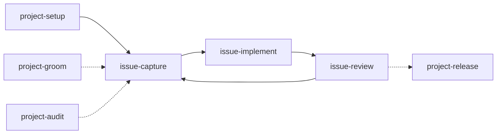
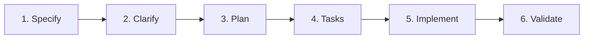
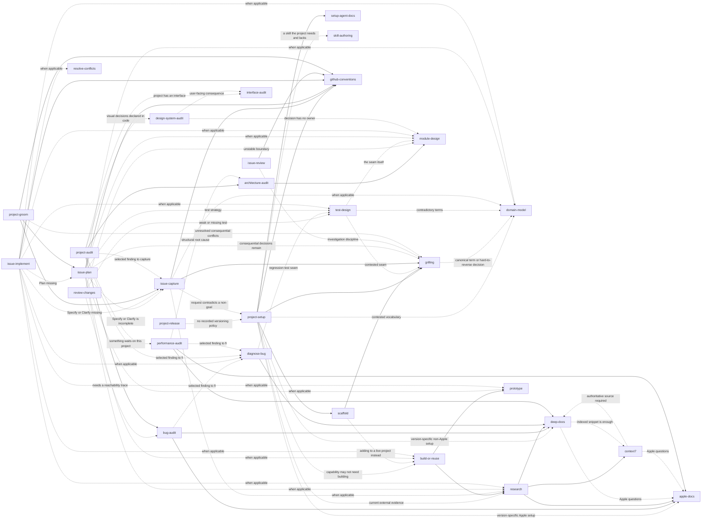

# Agent Skills

My personal collection of [Agent Skills](https://code.claude.com/docs/en/skills), ready for any skill-aware coding agent.

Most of these skills started in other open-source projects. Every one has been reviewed and adapted to match how I actually work: narrower triggers, less unnecessary process, clearer responsibilities, and tighter safety boundaries.

Every upstream project is credited below. If a skill is useful, credit belongs to its original author.

<br />

## 🧭 Start here

Two prefixes carry the work you do every day. `project-` acts on the whole project; `issue-` acts
on explicit issues and carries compatible prepared issues into coherent pull requests for
implementation and validation. Everything else stays directly invocable, and the prefixed skills
reach for it on their own when a step needs it.



### `project-` acts on the project

| Skill | What it settles | When |
| ----- | --------------- | ---- |
| [`project-setup`](project-setup/)     | What the product is and never does, then identity, Git policy, versioning, licence, metadata, and which skill owns what | Install, adapt, or update |
| [`project-groom`](project-groom/) | Duplicates, obsolete issues, taxonomy drift, blocking order across the backlog | Periodically |
| [`project-audit`](project-audit/)     | Every applicable audit, merged into one ranked list                        | Periodically |
| [`project-release`](project-release/) | Version, changelog, tag, publication                                       | When a version is due |

### `issue-` carries issues into pull requests

The four SDD phases, in order.

| Skill | Phase | What it settles |
| ----- | ----- | --------------- |
| [`issue-capture`](issue-capture/)     | Specify + Clarify | One request becomes one canonical issue |
| [`issue-plan`](issue-plan/)           | Plan + Tasks      | The approach, the tasks, the effort |
| [`issue-implement`](issue-implement/) | Implement         | Any number of prepared issues become the smallest coherent pull request set |
| [`issue-review`](issue-review/)       | Validate          | The formal verdict against every issue that pull request closes |

Ordinary delivery is three calls, not four: `issue-implement` writes the plan itself through
`issue-plan` when the issue is small and stops for your read when it is not.

`project-setup` covers the product definition and the repository in one interview, because the
description and topics it needs are outputs of knowing what the product is. It invokes
[`scaffold`](scaffold/) for a brand-new project with no source yet, which stays a separate skill
because it downloads and executes third-party code and keeps its own refusal to run over an
existing tree.

It runs in one of three modes, detected from the repository rather than from the request: **install**
a project from nothing, **adapt** one that already has its own conventions, or **update** one that
already carries this baseline and wants only what changed since. Adapting includes the skills the
repository already owns: setup inventories them, decides which one owns each task, and records that
precedence instead of running a generic workflow past a project skill that already knew the answer.

### Everything else

Nothing below has to be invoked by hand to complete a delivery. Each is here because it is worth
reaching for directly when you already know what you want.

| I need to…                                       | Use                                                   |
| ------------------------------------------------ | ----------------------------------------------------- |
| Start a new project's source tree                | [`scaffold`](scaffold/)                               |
| Consolidate local branches and worktrees safely  | [`clean-local-git`](clean-local-git/)                 |
| Review my working diff before it becomes a PR    | [`review-changes`](review-changes/)                   |
| Diagnose and fix a difficult bug                 | [`diagnose-bug`](diagnose-bug/)                                     |
| Decide what to test and where the seam belongs   | [`test-design`](test-design/)                         |
| Decide whether to build or reuse a capability    | [`build-or-reuse`](build-or-reuse/) |
| Improve module boundaries and dependencies       | [`module-design`](module-design/)                     |
| Resolve a merge, rebase, or cherry-pick conflict | [`resolve-conflicts`](resolve-conflicts/)             |
| Audit the architecture of a codebase             | [`architecture-audit`](architecture-audit/)           |
| Search aggressively for real bugs                | [`bug-audit`](bug-audit/)                           |
| Audit UI, UX, accessibility, or copy             | [`interface-audit`](interface-audit/)                 |
| Find where the project wastes time or memory     | [`performance-audit`](performance-audit/)             |
| Check the code expresses one visual system       | [`design-system-audit`](design-system-audit/)         |
| Research a current technical or product question | [`research`](research/)                               |
| Research Apple platform behavior                 | [`apple-docs`](apple-docs/)                           |
| Research another framework, SDK, API, or CLI     | [`deep-docs`](deep-docs/)                             |
| Quickly look up a library API                    | [`context7`](context7/)                               |
| Pressure-test a plan through questions           | [`grilling`](grilling/)                               |
| Clarify contradictory domain language            | [`domain-model`](domain-model/)                       |
| Check the rules for signing, branching, commits, merges, cleanup | [`github-conventions`](github-conventions/)  |
| Answer a question by running a small experiment  | [`prototype`](prototype/)                             |
| Create a continuation note for another session   | [`handoff`](handoff/)                                 |
| Create, review, or simplify an Agent Skill       | [`skill-authoring`](skill-authoring/)                 |
| Configure this repo's artifact paths             | [`setup-agent-docs`](setup-agent-docs/)               |
| Audit and reclaim disk space safely              | [`disk-cleaner`](disk-cleaner/)                       |
| Research cheaper regional digital-product offers | [`grey-market`](grey-market/)                         |

<br />

## Issue delivery workflow

The main development workflow follows six phases:



Each phase has one owner, one primary goal, and one exit condition.

| Phase         | Lead role   | Goal                                                              | Skill                                 |
| ------------- | ----------- | ----------------------------------------------------------------- | ------------------------------------- |
| **Specify**   | Product     | Define what must be done and which requirements must be satisfied | [`issue-capture`](issue-capture/)     |
| **Clarify**   | Product     | Resolve ambiguities, decisions, edge cases, and open questions    | [`issue-capture`](issue-capture/)     |
| **Plan**      | Architect   | Decide the implementation architecture and strategy               | [`issue-plan`](issue-plan/)           |
| **Tasks**     | Architect   | Break the plan into executable tasks and dependencies             | [`issue-plan`](issue-plan/)           |
| **Implement** | Implementer | Execute the tasks and produce the code                            | [`issue-implement`](issue-implement/) |
| **Validate**  | Validator   | Verify requirements, tests, regressions, and repository rules     | [`issue-review`](issue-review/)         |

`Specify`, `Clarify`, `Plan`, `Tasks`, and `Implement` follow the workflow established by [GitHub spec-kit](https://github.com/github/spec-kit).

`Validate` is specific to this collection. Spec-kit stops at implementation and treats verification as an optional analysis. Here, implementation is not complete until the pull request passes an explicit merge gate.

`issue-implement` executes tests and records validation evidence. `issue-review` inspects that
evidence, test code, checks, logs, and artifacts, but never runs tests or reruns CI.

### Backlog-wide coordination

[`project-groom`](project-groom/) operates across the entire workflow rather than owning one phase.

It reviews the complete backlog for:

* duplicate or overlapping issues
* obsolete issues
* missing requirements or decisions
* incomplete phases
* inconsistent labels
* dependency conflicts
* incorrect blocking order

When an issue has not completed a required phase, `project-groom` delegates that work to the skill that owns it.

Its final output includes every considered issue in one dependency graph, including independent
issues, and boxes together issues that can be closed by the same pull request.

### Issue labels

[`issue-capture`](issue-capture/) owns the default label taxonomy documented in [`issue-capture/LABELS.md`](issue-capture/LABELS.md).

When a repository does not already define its own convention:

* every issue has exactly one `type:` label
* every issue has exactly one `priority:` label
* an issue may have at most one `effort:` label
* an issue may have at most one `evidence:` label, when it came out of an audit
* an issue may have at most one `status:` label, as an exception rather than a workflow
* an issue may have any number of `area:` labels

An established repository convention always takes precedence over this default.

Those prefixes are the required spine, not the whole permitted set. A label outside them is left
untouched unless it duplicates a dimension. Migrating an existing repository onto the taxonomy is
[`project-groom`](project-groom/)'s job, gated on the owner approving the full mapping first.

There is no `phase:` label. The SDD phases live in the issue body, so a label mirroring them is a
copy that drifts, and the skills read the body regardless. Every state worth filtering on is already
readable from a field with one owner, and the filter for work that is not ready yet is the absence
of `effort:`, because the skill that writes the plan is the skill that sets the estimate.

Colour is an accelerant and never information: the family says which dimension a label belongs to,
the lightness says where in it, and nothing is encoded in colour alone.


### GitHub only

The issue-pipeline skills target GitHub Issues and pull requests, and deliberately support nothing
else. No GitLab, Bitbucket, Jira, Linear, or local-Markdown tracker fallback. Supporting several
forges means every skill degrades to the weakest common denominator, and the whole point of these
skills is to use what GitHub actually offers.

They reach the official GitHub API through the available native integration or `gh api`, and drop
from a higher-level `gh` command to the API whenever that command cannot express the operation.
Two consequences are load-bearing:

* **Findings are anchored.** `issue-review` publishes one formal review whose inline comments are
  attached to the exact lines, through
  `POST /repos/{owner}/{repo}/pulls/{number}/reviews`. Writing "line 84 should change" into a
  summary body, when the API could have attached that text to line 84, counts as a defective
  review.
* **Dependencies are read, not guessed.** `project-groom` builds its blocking order from
  GitHub's own `blockedBy` and `blocking` issue dependencies, not from sentences in issue bodies.

* **Pull requests close their full issue set.** Every pull request body starts with one
  `Closes #N` line per issue it resolves. Before merge, the API must report every intended issue
  in `closingIssuesReferences`; after merge, every one is read back as closed.

* **The verdict is always published.** GitHub refuses a formal `APPROVE` on a pull request the
  same account authored. That refuses the review *event*, not the review: `issue-review` posts the
  same findings as a comment opening with `Approved ✅` or `Requested Changes 🔄`, and reports the
  formal event as refused. A review that publishes nothing because the API said no is a failed
  review.

Every mutation is read back before it is reported. An issue, comment, review, or link exists when
the API says it does, never because a command exited zero.

Everything an agent publishes there is signed with the agent, model and reasoning level that wrote
it. Every branch is named for the agent and its complete issue set: `issue-70` for one, or a
numerically sorted form such as `issues-70-73-154` for several, always without leading zeros.
Every commit made for an issue ends its subject with `(#54)`, every pull request starts with its
complete block of `Closes` lines, every branch merges with all of its commits instead of being
squashed into one, and every draft, diff or patch written to disk along the way is deleted before
the run reports completion. [`github-conventions`](github-conventions/) owns those rules. The
signature is never a repository's to waive; the branch, commit and merge shapes yield only to a
repository that documents its own.


<br />

## ⚙️ How skills run

A skill may be invoked by the model, by the user, or only by the user.

### Model or user

The agent may load the skill automatically when its description clearly matches the task. The user may also invoke it directly by name.

These skills use narrow descriptions and explicit non-triggers so they remain inactive during unrelated work.

This category also includes focused child workflows explicitly delegated by a parent skill that the user already invoked.

### User only

The skill runs only when explicitly invoked by name.

Its frontmatter contains:

```yaml
disable-model-invocation: true
```

This restriction is used for broad reviews, interviews, and workflows whose side effects should never begin without being asked for.

Writing to external state does not by itself force this restriction. A narrow child workflow that a user-invoked parent has to reach through the skill tool stays model-invocable, states that delegation in its own file, and may not exceed the mutation its parent already authorized. `issue-capture` and `setup-agent-docs` are the two cases.

### Mutation boundaries

Every skill declares the maximum level of change it may perform.

| Mutation         | Allowed behavior                                                       |
| ---------------- | ---------------------------------------------------------------------- |
| `none`           | Read, analyze, and report only                                         |
| `temporary`      | Create disposable files or experiments, with every artifact reported   |
| `docs`           | Write documentation, but never production code                         |
| `write`          | Change project code, configuration, documentation, or project state    |
| `approval-gated` | Make no change until each proposed action has been explicitly approved |

A skill may do less than its declared mutation level, but it must never do more.

<br />

## Skill catalog

### Setup

Setup skills establish repository-level conventions and operating rules.

| Skill                                   | Invocation    | Mutation | What it does                                                                                                                  | Upstream                                                                                                                                   |
| --------------------------------------- | ------------- | -------- | ----------------------------------------------------------------------------------------------------------------------------- | ------------------------------------------------------------------------------------------------------------------------------------------ |
| [`scaffold`](scaffold/)       | User          | `write`  | Generate a brand-new project's initial source tree from a maintained scaffolder, then hand over to setup.                     | Written for this collection                                                                                                                |
| [`project-setup`](project-setup/)       | User          | `write`  | Settle what the product is and never does, then align the repository's identity, rules, Git policy, metadata, foundations and skill ownership, whether installing, adapting or updating. | [product-on-purpose/pm-skills](https://github.com/product-on-purpose/pm-skills) (product-definition half only)                              |
| [`setup-agent-docs`](setup-agent-docs/) | Model or user | `docs`   | Configure optional per-repository paths for glossaries, ADRs, research, handoffs, and prototypes.                             | [mattpocock/skills → setup-matt-pocock-skills](https://github.com/mattpocock/skills/tree/main/skills/engineering/setup-matt-pocock-skills) |

`scaffold` runs first and only for a new project with no source yet. It generates code and nothing else; `project-setup` refuses to scaffold precisely so that running setup against a real codebase can never inject source into it.

`project-setup` owns the repository's general operating model, including which skill owns which task when the repository has skills of its own. It records that precedence and reports a skill the project needs and lacks; writing one is `skill-authoring`'s job, and no skill from this collection is ever copied into the target repository.

When optional documentation paths are needed, it delegates that narrower configuration to `setup-agent-docs`.

### Issue pipeline

The four `issue-` skills move requests from canonical issues to validated pull requests, one SDD
phase each. Capture and planning stay one issue at a time; implementation accepts any number of
prepared issues and partitions them into the smallest coherent PR set, and validation covers every
issue each PR closes. `project-groom` sits with them because it works across the whole backlog.

| Skill                                 | Invocation    | Mutation | What it does                                                                                                                  | Upstream                                                                                                                                                                      |
| ------------------------------------- | ------------- | -------- | ----------------------------------------------------------------------------------------------------------------------------- | ----------------------------------------------------------------------------------------------------------------------------------------------------------------------------- |
| [`issue-capture`](issue-capture/)     | Model or user | `write`  | Convert one problem or request into one canonical GitHub Issue. Owns Specify, Clarify, and the default label taxonomy.        | Written for this collection                                                                                                                                                   |
| [`issue-plan`](issue-plan/)           | User          | `write`  | Produce the implementation architecture, strategy, executable tasks, dependencies, and effort estimate for exactly one issue. | [obra/superpowers](https://github.com/obra/superpowers)                                                                                                                       |
| [`issue-implement`](issue-implement/) | User          | `write`  | Implement any number of prepared GitHub Issues, combining only compatible issues into each coherent pull request.               | [openclaw/openclaw](https://github.com/openclaw/openclaw), [github/spec-kit](https://github.com/github/spec-kit) |
| [`issue-review`](issue-review/)         | User          | `write`  | Validate one pull request against every issue it closes and the repository rules.                                              | [NousResearch/hermes-agent](https://github.com/NousResearch/hermes-agent), [SpillwaveSolutions/pr-reviewer-skill](https://github.com/SpillwaveSolutions/pr-reviewer-skill)    |
| [`project-groom`](project-groom/) | User          | `write`  | Review the complete backlog and graph every issue, dependency, and coherent same-PR delivery group.                           | [github/gh-aw](https://github.com/github/gh-aw), behavioral reference                                                                                                         |

Each issue-level skill owns a narrow part of the workflow.

The issue pipeline commands that accept existing GitHub targets support direct URLs as well as
numbers:

| Skill | Accepted invocation targets |
| --- | --- |
| `/issue-plan` | One issue number or issue URL |
| `/issue-implement` | One or more issue numbers or issue URLs from the same repository |
| `/issue-review` | An issue number or URL, a direct PR URL, or `pr <PR-number-or-URL>` |

For review, a bare number always means an issue; `pr` is required only when the PR target is a
number. A URL's host, owner, repository, type, and number are always authoritative.

`project-groom` does not replace them. It detects what is missing and routes the issue to the appropriate owner.

### Foundations

Foundations are reusable capabilities.

They may be invoked directly, but their primary purpose is to support other skills through explicit delegation.

| Skill                           | Invocation    | Mutation    | What it does                                                                                                                                                                                         | Upstream                                                                                                                                                                                       |
| ------------------------------- | ------------- | ----------- | ---------------------------------------------------------------------------------------------------------------------------------------------------------------------------------------------------- | ---------------------------------------------------------------------------------------------------------------------------------------------------------------------------------------------- |
| [`apple-docs`](apple-docs/)     | Model or user | `none`      | Research version-specific Apple platform behavior using Apple documentation, Swift Evolution, Xcode context, local Xcode documentation, HIG, WWDC, release notes, signing, and distribution sources. | [Ahrentlov/apple-docs-skill](https://github.com/Ahrentlov/apple-docs-skill)                                                                                                                    |
| [`context7`](context7/)         | Model or user | `none`      | Quickly query library documentation through the Context7 index by resolving a library ID and querying one focused topic.                                                                             | [upstash/context7 → context7-cli](https://github.com/upstash/context7/tree/master/skills/context7-cli)                                                                                         |
| [`deep-docs`](deep-docs/)       | Model or user | `none`      | Research version-specific documentation for non-Apple frameworks, SDKs, APIs, CLIs, and platforms using source-linked evidence.                                                                      | Written for this collection. Architecture adapted from [apple-docs-skill](https://github.com/Ahrentlov/apple-docs-skill) and [appledeepdoc-mcp](https://github.com/Ahrentlov/appledeepdoc-mcp) |
| [`github-conventions`](github-conventions/) | Model or user | `none`      | Hold the rules every publishing skill follows: signatures, branches, commit issue numbers, leading PR closing lines, verified issue closure after merge, merge method, review fallback, and temporary files. | Written for this collection |
| [`domain-model`](domain-model/) | Model or user | `docs`      | Resolve contradictory domain terminology, states, rules, and relationships.                                                                                                                          | [mattpocock/skills → domain-modeling](https://github.com/mattpocock/skills/tree/main/skills/engineering/domain-modeling)                                                                       |
| [`grilling`](grilling/)         | Model or user | `none`      | Provide the shared interview discipline used by other skills: one decision at a time, always with a recommendation.                                                                                  | [mattpocock/skills → grilling](https://github.com/mattpocock/skills/tree/main/skills/productivity/grilling)                                                                                    |
| [`prototype`](prototype/)       | Model or user | `temporary` | Run a disposable experiment when executing code provides stronger evidence than discussing possibilities.                                                                                            | [mattpocock/skills → prototype](https://github.com/mattpocock/skills/tree/main/skills/engineering/prototype)                                                                                   |
| [`research`](research/)         | Model or user | `docs`      | Answer a technical or product question using current primary sources and preserve the result when useful.                                                                                            | [mattpocock/skills → research](https://github.com/mattpocock/skills/tree/main/skills/engineering/research)                                                                                     |
| [`test-design`](test-design/)   | Model or user | `write`     | Decide what to test, where the seam belongs, and whether a test earns its keep. Declines to write a weak test rather than filling the gap with one.                                                  | [mattpocock/skills → tdd](https://github.com/mattpocock/skills/tree/main/skills/engineering/tdd)                                                                                               |

#### Documentation routing

The documentation skills have different responsibilities:

* Use [`apple-docs`](apple-docs/) for Apple platforms.
* Use [`context7`](context7/) when an indexed library snippet is sufficient.
* Use [`deep-docs`](deep-docs/) when the answer must be traced to an authoritative, version-specific source.
* Use [`research`](research/) for broader technical or product questions that may combine several primary sources.

`context7` is a fast index, not an authoritative source by itself.

When the conclusion requires official evidence, `deep-docs` takes over.

### Engineering workflows

Workflow skills complete one concrete engineering task from start to finish.

| Skill                                                 | Invocation    | Mutation | What it does                                                                                                               | Upstream                                                                                                                                               |
| ----------------------------------------------------- | ------------- | -------- | -------------------------------------------------------------------------------------------------------------------------- | ------------------------------------------------------------------------------------------------------------------------------------------------------ |
| [`diagnose-bug`](diagnose-bug/)                                     | Model or user | `write`  | Reproduce a difficult bug, form hypotheses, identify the root cause, apply the smallest valid fix, and verify it.          | [mattpocock/skills → diagnosing-bugs](https://github.com/mattpocock/skills/tree/main/skills/engineering/diagnosing-bugs)                               |
| [`build-or-reuse`](build-or-reuse/) | Model or user | `none`   | Decide whether one capability should reuse an existing feature, native API, dependency, service, or custom implementation. | [felinto-dev/felinto-skills → dont-reinvent-the-wheel](https://github.com/felinto-dev/felinto-skills/tree/main/.agents/skills/dont-reinvent-the-wheel) |
| [`clean-local-git`](clean-local-git/)             | User          | `write`  | Audit all local Git state, stop for decisions on unpublished work, then remove only proven-redundant branches and clean worktrees before fast-forwarding the default branch. | Written for this collection |
| [`project-release`](project-release/)                                 | User          | `write`  | Cut one release under the versioning policy the repository already recorded: bump, changelog, tag, publication.            | Written for this collection                                                                                                                            |
| [`module-design`](module-design/)                     | Model or user | `write`  | Improve module boundaries, interfaces, dependency direction, cohesion, and test seams.                                     | [mattpocock/skills → codebase-design](https://github.com/mattpocock/skills/tree/main/skills/engineering/codebase-design)                               |
| [`resolve-conflicts`](resolve-conflicts/)             | Model or user | `write`  | Resolve a merge, rebase, or cherry-pick conflict by reconstructing the intent of both sides.                               | [mattpocock/skills → resolving-merge-conflicts](https://github.com/mattpocock/skills/tree/main/skills/engineering/resolving-merge-conflicts)           |

`diagnose-bug` is for a concrete defect that must be diagnosed and fixed.

`bug-audit`, described below, is different: it audits a codebase for defects but does not fix them.

### Audits

Audit skills inspect what already exists, rank findings, and propose what is worth addressing.

They do not implement their own findings.

| Skill                                         | Invocation | Mutation    | What it does                                                                                         | Upstream                                                                                                                                                                                                              |
| --------------------------------------------- | ---------- | ----------- | ---------------------------------------------------------------------------------------------------- | --------------------------------------------------------------------------------------------------------------------------------------------------------------------------------------------------------------------- |
| [`architecture-audit`](architecture-audit/) | User       | `docs`      | Assess a codebase and rank architecture improvements using concrete code evidence.                   | [mattpocock/skills → improve-codebase-architecture](https://github.com/mattpocock/skills/tree/main/skills/engineering/improve-codebase-architecture)                                                                  |
| [`bug-audit`](bug-audit/)                   | User       | `temporary` | Search adversarially for verified functional, logic, runtime, and security bugs without fixing them. | [codexstar69/bug-hunter](https://github.com/codexstar69/bug-hunter)                                                                                                                                                   |
| [`project-audit`](project-audit/)             | User       | `temporary` | Run every applicable audit and merge the findings into one ranked list across lenses.               | Written for this collection                                                                                                                                                                                             |
| [`interface-audit`](interface-audit/)             | User       | `none`      | Audit UI, UX, accessibility, and copy at routed `low`, `medium`, or `high` depth.                    | [jakubkrehel/skills](https://github.com/jakubkrehel/skills), [content-designer/ux-writing-skill](https://github.com/content-designer/ux-writing-skill), [Thecsiz/ux-critique](https://github.com/Thecsiz/ux-critique) |
| [`performance-audit`](performance-audit/)     | User       | `temporary` | Map the hot paths and rank resource-cost findings, refusing to call anything slow without evidence.  | Written for this collection                                                                                                                                                                                           |
| [`design-system-audit`](design-system-audit/) | User       | `none`      | Judge whether the code expresses one visual system: token ownership, bypass, and duplicate components. | Written for this collection                                                                                                                                                                                         |
| [`review-changes`](review-changes/)           | User       | `none`      | Review the local diff against a fixed point on two separate axes: standards and intent.             | [mattpocock/skills → code-review](https://github.com/mattpocock/skills/tree/main/skills/engineering/code-review)                                                                                                     |

An audit finding becomes implementation work only after it is selected and captured as a proper issue.

This keeps optional improvements separate from immediate merge blockers.

**`audit` and `review` are different jobs, and the names say which.** An `-audit` inspects a body of
work that already exists and asks what is wrong with it. A `review` inspects a specific change set
against what it was supposed to do: [`review-changes`](review-changes/) for a local diff,
[`issue-review`](issue-review/) for a pull request. One is unbounded and finds problems nobody
reported; the other is bounded by a diff and has a verdict to reach.

Every audit starts from zero. Earlier conversation context, a verdict from a previous run, and any
report or artifact one left behind are prior opinion, not evidence. An audit allowed to read its own
last report confirms it, and the second run then reads as corroboration when it is an echo.

`interface-audit` and `design-system-audit` look at the same pixels and answer different questions.
`interface-audit` judges the interface as a user perceives it: does this screen work. `design-system-audit`
judges how that appearance is expressed in code: does each visual decision have exactly one owner.
A product can pass the first and fail the second, which means its consistency is being maintained by
hand and will drift.

`performance-audit` holds one line that the others do not need: a cost claim nobody measured is not a
finding, it is a profiling plan. Findings carry `Verified`, `Likely`, `Needs profiling`, or `Unknown`,
and severity never drops just because the magnitude is unmeasured.

### Authoring and continuity

These skills produce durable documentation as their primary result.

| Skill                                       | Invocation | Mutation | What it does                                                                                      | Upstream                                                                                                                            |
| ------------------------------------------- | ---------- | -------- | ------------------------------------------------------------------------------------------------- | ----------------------------------------------------------------------------------------------------------------------------------- |
| [`handoff`](handoff/)                       | User       | `docs`   | Produce a compact continuation note for another agent or a later session.                         | [mattpocock/skills → handoff](https://github.com/mattpocock/skills/tree/main/skills/productivity/handoff)                           |
| [`skill-authoring`](skill-authoring/)       | User       | `write`  | Create, review, or simplify Agent Skills.                                                         | [mattpocock/skills → writing-great-skills](https://github.com/mattpocock/skills/tree/main/skills/productivity/writing-great-skills) |

`grilling` is the interview and records nothing by itself. When one settles a canonical term or a hard-to-reverse decision, it routes to `domain-model`, which owns the glossary and the ADR.

Use `handoff` when the work must continue in another session or with another agent.

### Personal utilities

Personal skills act on the user's machine or personal workflow rather than on a project repository.

They are intentionally not configured by repository-level setup.

| Skill                           | Invocation    | Mutation         | What it does                                                                                                                                           | Upstream                                                                                                                       |
| ------------------------------- | ------------- | ---------------- | ------------------------------------------------------------------------------------------------------------------------------------------------------ | ------------------------------------------------------------------------------------------------------------------------------ |
| [`disk-cleaner`](disk-cleaner/) | Model or user | `approval-gated` | Audit reclaimable disk space, classify findings by risk, and clean only explicitly approved items.                                                     | [gccszs/disk-cleaner](https://github.com/gccszs/disk-cleaner)                                                                  |
| [`grey-market`](grey-market/)   | Model or user | `none`           | Locate digital products offered far below official prices through regional and community sources. It locates sellers but never performs a transaction. | [felinto-dev/felinto-skills → grey-market](https://github.com/felinto-dev/felinto-skills/tree/main/.agents/skills/grey-market) |

A repository has no authority to configure conventions for personal machine maintenance or purchasing research.

That separation is deliberate.

<br />

## 🧱 Classification model

Skills are classified through metadata rather than nested directory paths.

Each skill declares three properties in its frontmatter:

```yaml
metadata:
  scope: project
  role: audit
  mutation: docs
```

### Scope

Scope describes where the skill acts.

| Scope      | Acts on                                     | Configured by `setup-agent-docs`? |
| ---------- | ------------------------------------------- | --------------------------------- |
| `project`  | A codebase or repository                    | Yes                               |
| `personal` | The user's machine or personal workflow     | No                                |
| `meta`     | The skills collection or agent setup itself | Not applicable                    |

The two `meta` skills are listed with project skills because that is where they operate, even though their subject is the skill system itself.

### Role

Role describes the kind of responsibility the skill owns.

| Role         | Meaning                                             |
| ------------ | --------------------------------------------------- |
| `setup`      | Establishes an environment or convention            |
| `foundation` | Provides a reusable capability for other skills     |
| `workflow`   | Completes one concrete task with a start and finish |
| `audit`      | Inspects existing work and ranks findings           |
| `authoring`  | Produces a durable artifact                         |
| `utility`    | Performs an operational task outside a project      |

Frequency is intentionally not part of the classification.

A skill such as `resolve-conflicts` may go unused for months and still remain a workflow because it completes one concrete operational task.


### Upstream provenance

A skill adapted from someone else's work pins that work with a commit and a date, never a branch
name. A branch moves and the claim silently becomes false.

```yaml
metadata:
  upstream: https://github.com/owner/repo   # repository URL, not a /tree/<branch>/ deep link
  upstream-author: Author Name
  upstream-path: skills/engineering/thing   # omitted when the skill is the repository root
  upstream-revision: <full 40-character SHA in the upstream repository>
  upstream-checked: 2026-08-03              # ISO date of the last comparison
```

The five fields travel together and answer two different questions.

`upstream-revision` answers **what changed**. It is the SHA in the upstream repository, not the
SHA of the local baseline commit, which is what makes drift measurable:

```sh
gh api "repos/<owner>/<repo>/commits?path=<upstream-path>&since=<date>" --jq 'length'
```

`upstream-checked` answers **is this stale**. It is the date of the last comparison against
upstream, not the import date. Comparing and finding nothing changed advances this date on its
own, with no other edit. Only a recent date can answer the question, so a check that finds nothing
is still worth recording.

When a skill draws on several upstreams, the frontmatter names the primary one and that skill's
`THIRD_PARTY_NOTICES.md` is authoritative for the full set, pinning each separately.

Skills written for this collection carry no `upstream-*` fields at all.

### Why directories remain flat

The taxonomy exists in metadata, not in paths.

Every top-level skill directory remains self-contained and independently copyable.

The issue-pipeline skills are grouped by phase in this README rather than by role because the phase is what distinguishes them operationally.

For example, `issue-capture` and `issue-plan` are both authoring skills, but one owns Specify and Clarify while the other owns Plan and Tasks.

<br />

## 🔗 How skills relate

Skills reference one another only where a real delegation path exists.

A connection does not mean that the target skill always runs. Dashed edges represent conditional delegation.

<details>
<summary><strong>Show the complete dependency graph</strong></summary>



</details>

<details>
<summary><strong>How conditional delegation works</strong></summary>

`project-setup` settles what the product is before anything is built. `issue-capture` later checks a request against its non-goals and raises a contradiction rather than silently widening the product.

`scaffold` generates a new project's tree and stops. Adding a framework or dependency to a project that already runs is not scaffolding; that decision goes to `build-or-reuse` and then to ordinary implementation.

`issue-implement` writes the plan itself through `issue-plan` when the issue is small, and stops for a human read when it is not. Missing `Specify` or `Clarify` always goes back to `issue-capture`, because a product decision is the owner's.

`project-setup` establishes the repository's main guidance before delegating optional documentation-path configuration to `setup-agent-docs`.

It uses:

* `grilling` for consequential setup decisions
* `research` when current external evidence is required
* `apple-docs` or `deep-docs` when configuration depends on version-specific behavior

`architecture-audit` delegates to `module-design` when a finding requires deeper analysis of boundaries, interfaces, cohesion, or dependency direction.

`review-changes` routes a finding out instead of growing into it: a weak or missing test to `test-design`, an unstable boundary to `module-design`, and a suspected defect that needs a reachability trace to `bug-audit`. It names the route and stops there.

`test-design` owns where a test attaches and whether it earns its keep. `module-design` owns the boundary the seam attaches to, so a contested seam goes there; contradictory domain terms go to `domain-model`; and a seam whose choice changes what ships goes to `grilling`. `diagnose-bug` delegates the placement of a regression test here when the seam is unclear.

`project-release` executes the versioning contract that `project-setup` recorded. If no policy exists, it stops and points back rather than choosing a version scheme on the owner's behalf.

`bug-audit` routes documented Apple behavior to `apple-docs` and other framework or library behavior to `deep-docs`.

A confirmed bug is handed to `diagnose-bug` only after the user selects it for implementation in a separate task.

`performance-audit` does the same, because a cost claim that depends on framework or runtime behavior has to be verified rather than assumed; where authoritative behavior cannot be established, the candidate is downgraded instead of guessed. It routes a structural cause shared by several findings to `architecture-audit` and names the route without performing it. A reported slowdown with a known symptom is `diagnose-bug`'s job, not this one's: this audit looks for cost nobody has reported yet.

`design-system-audit` reports that a visual decision has no owner; where that owner should live is a `module-design` question. When a finding also harms a user, such as a state expressed by color alone, it routes to `interface-audit` rather than judging the user consequence itself.

`build-or-reuse` may use:

* `research` to investigate existing options
* `prototype` when a small experiment provides better evidence
* `grilling` when unresolved requirements would change the decision
* `architecture-audit` only when the user explicitly requests a broad reuse audit

`research`, `diagnose-bug`, and `build-or-reuse` route to documentation specialists only when their conclusions depend on documented behavior.

`context7` and `deep-docs` may delegate to one another:

* `context7` is the fast path when an indexed snippet is sufficient
* `deep-docs` takes over when an authoritative source is required or the library is not indexed

`github-conventions` is unconditional for every skill that publishes on GitHub. It settles how a
published text is signed, how a branch names one issue or a complete sorted issue set, how a commit
subject carries its issue number, how a PR body starts with the issues it closes, how closure is
verified after merge, that commits are not squashed, what happens when the API refuses a formal
review event, and where temporary files may live, so those answers cannot drift apart across five
skills.

`issue-capture` uses `domain-model` or `research` only when ambiguity or missing evidence prevents the issue from being captured correctly.

`issue-plan` delegates back to `issue-capture` when Specify or Clarify is incomplete.

It may also use specialized architecture, research, reuse, or prototyping skills when those capabilities are directly relevant to the implementation plan.

`issue-implement` may use specialized workflows such as `diagnose-bug`, `module-design`,
`prototype`, or `resolve-conflicts`, but only when they directly support the selected prepared
issues and their coherent pull request groups.

`project-groom` delegates incomplete issue phases to `issue-capture` or `issue-plan`.

</details>

<br />

## 🔄 Synchronizing all skills

The repository includes commands that link every top-level skill into the corresponding agent directory.

| Command       | Destination                |
| ------------- | -------------------------- |
| `sync-all`    | All supported destinations |
| `sync-agents` | `~/.agents/skills`         |
| `sync-claude` | `~/.claude/skills`         |
| `sync-gemini` | `~/.gemini/config/skills`  |

The commands may be run from any working directory and are safe to run repeatedly.

Use `--dry-run` to preview changes:

```sh
/path/to/skills/sync-all --dry-run
```

Existing real files and directories are reported as conflicts and left untouched. Repository changes become available immediately because the commands create links rather than independent copies.

### Adding `sync-all` to `PATH`

To make the combined command available from any zsh session:

```sh
mkdir -p ~/.local/bin
ln -s /path/to/skills/sync-all ~/.local/bin/sync-all
```

<br />

## 📄 License

The original work in this repository, including its adaptations, documentation, and references, is [MIT licensed](LICENSE).

That grant covers only the work created for this collection. Vendored or adapted upstream work retains its original license.

The MIT grant does not extend to the upstream material inside `issue-review`, `issue-implement`, `issue-plan`, `build-or-reuse`, and `grey-market`. Those upstream repositories publish no license, so that permission is not mine to give. [`NOTICE.md`](NOTICE.md) is authoritative on this.

See [`NOTICE.md`](NOTICE.md) for the exact attribution and licensing status of every component.
